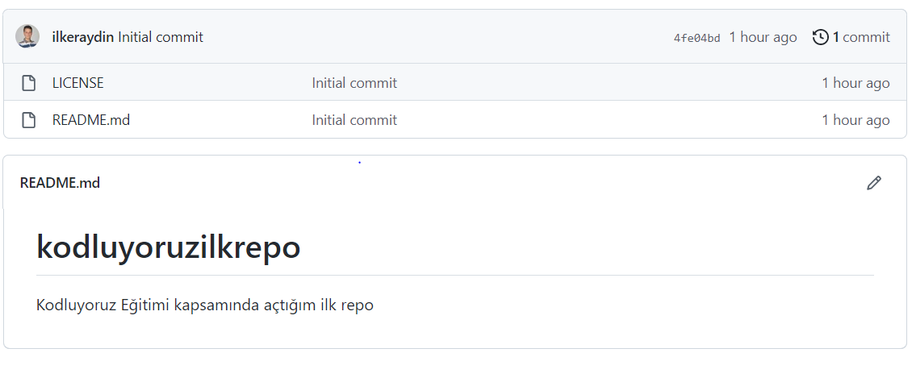

# Kodluyoruz Ilk Repo

Bu repo Kodluyoruz [Kodluyoruz] (https://www.kodluyoruz.org/) GIT eğitimimde oluşturduğum ilk repo.
İçerisinde bir adet README dosyası, bir adet index.html barındırıyor.

<<<<<<< HEAD

=======

>>>>>>> 976054f29ddeacb10af0b5196664f6e8047d61c5

## Installtion

Öncelikle Projeyi clonelayın. (https://github.com/ilkeraydin/kodluyoruzilkrepo.git)

'''bash
git clone https://github.com/ilkeraydin/kodluyoruzilkrepo.git
'''

## Usage

Projeyi cloneladıktan sonra Visual Studio Code programında açınız.

Linux için:
'''Linux
cd kodluyoruzilkrepo
code .
'''

## Contributing
Pull requestler kabul edilir. Büyük değişiklikler için, lütfen önce neyi değiştirmek istediğinizi tartışmak için bir konu açınız.

## License

[MIT] (https://choosealicense.com/licenses/mit/)
<<<<<<< HEAD

[def]: img/github.png
=======
>>>>>>> 976054f29ddeacb10af0b5196664f6e8047d61c5
